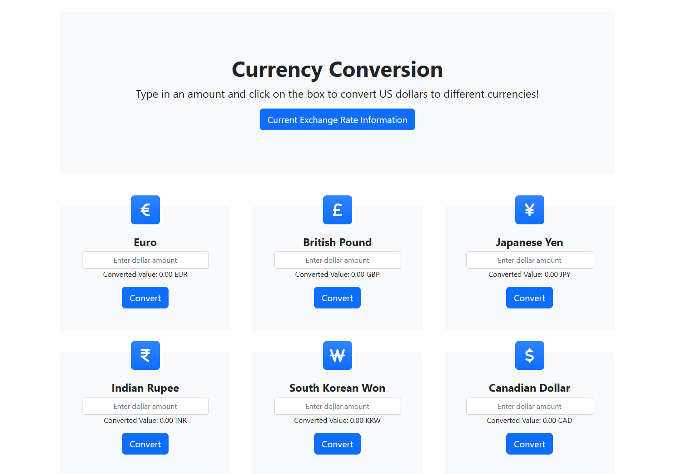
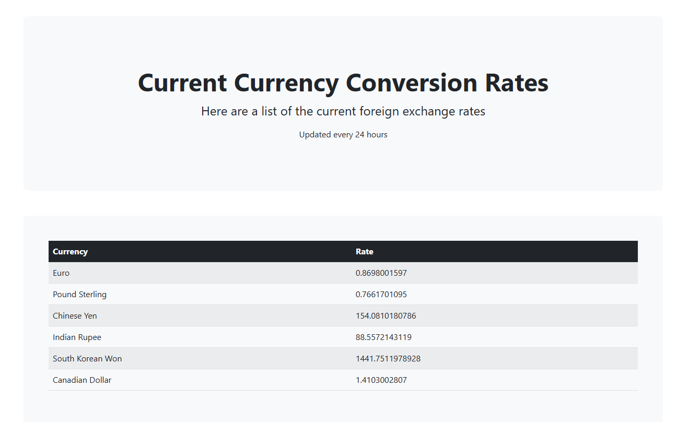

# Currency-Converter
This project was developed by Sean Gallagher, Christian Marinas, and Will Schreyer.

# What does this program do?
This program converts between 6 different currencies using an API that updates conversion rates in real-time. This allows for quick conversions from USD to all these currencies. There is a second page that also lists the live conversion rates given by our API, allowing users to see the changes in currency conversion rates.

# My Contributions
My contribution to this project was editing the index.html file given by the bootstrap template used in order for it to fit our needs. In addition, I added functionality for new text boxes and added new graphics for each currency. Finally, I added functionality for the second page which displays the live conversion rates given by the API.

# How to run
In order to run:
1. Clone the repo
2. Go into the Currency-Converter/Project3 and find the index.html
3. Open the index.html in a browser

